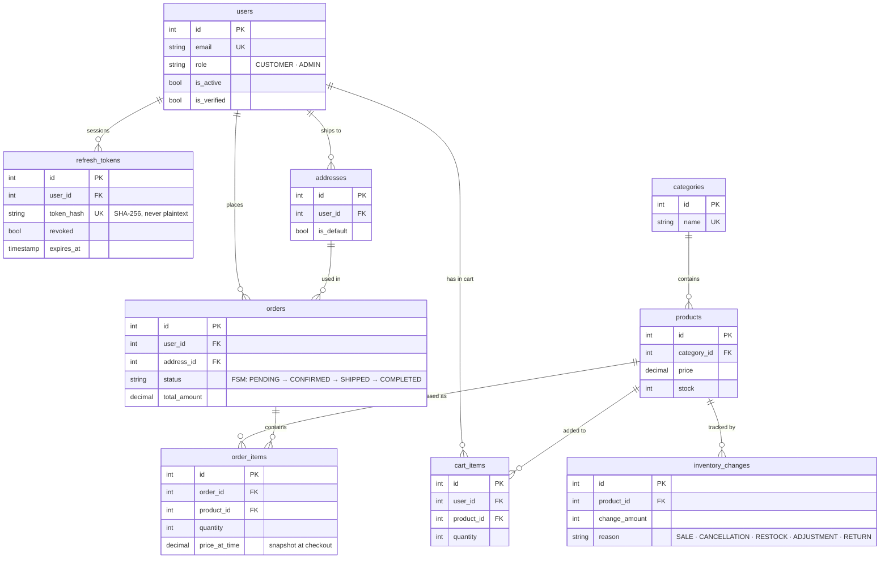

<div align="center">

# E-Commerce Backend

**Production-grade e-commerce backend API built with real-world engineering practices, designed under real constraints and trade-offs.**

[](https://python.org)
[](https://fastapi.tiangolo.com)
[](https://postgresql.org)
[](https://redis.io)
[](https://sqlalchemy.org)
[](https://docker.com)
[](https://github.com/anasmohamed05221/E-Commerce/actions)

</div>

---

## Live Demo

| | |
|---|---|
| **API** | https://ecommerce-api-25zx.onrender.com |
| **Docs (Swagger UI)** | https://ecommerce-api-25zx.onrender.com/docs |
| **Health** | https://ecommerce-api-25zx.onrender.com/health |

> Free tier instances spin down after inactivity, first request may take ~50 seconds to wake up.

---

Built as a deliberate learning exercise to practice backend engineering the way it works in real teams, not to follow a tutorial. The system was shaped iteratively as complexity grew, converging into a clean, layered architecture that keeps it maintainable, flexible, and scalable. It deals with real challenges such as race conditions, atomic transactions, token security, cache invalidation, and production deployment.

---

## Features

### 👤 Auth & Identity
- Email registration with 6-digit verification code (10-minute expiry)
- Login with short-lived JWT access tokens + long-lived refresh tokens
- Token rotation on every refresh: old token revoked, reuse rejected
- Two-step password change via email confirmation (confirm or deny)
- Time-limited, single-use password reset tokens
- Logout: single session or all devices at once
- Profile update (name, phone number) and self-deactivation

### 🛍️ Shopping
- Browse products with `category`, `min_price`, `max_price` filters and pagination
- View individual product details
- Manage cart: add, update quantity, remove items, or clear all
- Manage multiple delivery addresses with a default flag
- Place orders with COD payment and a selected address
- View paginated order history and individual order details
- Cancel eligible orders (PENDING status only)

### 🔧 Admin
- Full product and category CRUD
- View all orders across the platform with pagination
- Drive orders through the status lifecycle (PENDING → CONFIRMED → SHIPPED → COMPLETED)
- List all users and view individual profiles
- Deactivate and reactivate accounts
- Change user roles (promote to admin or demote back to customer)

---

## Engineering Highlights

> Decisions that shaped the system, and why they were made.

**⚡ Checkout is atomic or it doesn't happen.**
Stock decrement, order creation, cart clear, and inventory log all commit in a single transaction. If any step fails, everything rolls back. No partial orders, no phantom stock.

**🔒 Race conditions are prevented at the database level.**
Checkout and order cancellation use `SELECT FOR UPDATE` (pessimistic locking) to acquire a row-level lock before reading stock. Two concurrent checkouts for the same product cannot both succeed on 1 unit of stock.

**🛡️ Tokens are never stored in plaintext.**
Refresh tokens, password reset tokens, and password change tokens are all hashed with SHA-256 before being written to the database. The raw token travels over the wire once, only its hash lives in the DB. Passwords use bcrypt.

**🔄 Token rotation with reuse detection.**
On every refresh, the old token is revoked and a new pair is issued. Presenting a revoked token is treated as a security event.

**📊 Order status follows a strict FSM.**
`PENDING → CONFIRMED → SHIPPED → COMPLETED`. Skipping states or moving backwards raises a 409. Cancellation is a separate path with different rules for customers vs. admins.

**💰 Price snapshots at purchase time.**
`order_items.price_at_time` captures the product price at checkout. Changing a product price never retroactively affects existing orders.

**📋 Every stock change is audited.**
`inventory_changes` logs every increment and decrement with a reason (`SALE`, `CANCELLATION`, `RESTOCK`, `ADJUSTMENT`, `RETURN`). Stock is never mutated silently.

**⚡ Redis for caching and rate limiting.**
Category listings are cached with a 1-hour TTL (cache-aside pattern). Every write explicitly invalidates the cache, stale data is never served after a mutation. Rate limiting counters live in Redis too, shared across all Gunicorn workers so a user can't bypass limits by hitting different processes.

**📄 Paginated responses on every list endpoint.**
Products, orders, and admin views all return `{ items, total, limit, offset }`. Callers can page through large datasets without pulling unbounded result sets. Product browsing also supports filters: `category_id`, `min_price`, `max_price`.

**🖥️ Logging is structured and environment-aware.**
Every request is logged as JSON with a unique request ID, status code, duration, and client IP. Production logs go to stdout only (12-Factor App); development logs go to rotating files.

**🏥 Health check verifies dependencies, not just process uptime.**
`GET /health` pings PostgreSQL and Redis and returns 503 if either is unreachable, not just 200 because the process is alive.

---

## Architecture

```
Request
  └── Middleware  (structured logging · request ID tracing · rate limiting · CORS)
        └── Router     (HTTP contract · status codes · dependency injection)
              └── Schema     (Pydantic validation · request parsing · response shaping)
                    └── Service    (business logic · authorization · DB transactions)
                          └── Model      (SQLAlchemy ORM → PostgreSQL)
```

Hard rules enforced throughout:
- **Routers** never touch the database directly
- **Services** own all business logic and authorization checks, ownership is verified here, not in the router
- **Schemas** validate all input at the boundary: password strength, phone normalization (E.164 via libphonenumber), email format
- **Redis** is accessed only from services, never from routers

---

## Auth System

Not a tutorial JWT setup. Every edge case is handled.

| Capability | Detail |
|---|---|
| Registration | Email + password, validated via Pydantic + phonenumbers |
| Email Verification | 6-digit code with 10-minute expiry |
| Login | Short-lived access token (15 min) + long-lived refresh token (7 days) |
| Token Rotation | Old refresh token revoked on every refresh, reuse is rejected |
| Token Storage | All tokens hashed with SHA-256 before DB write, plaintext never persists |
| Password Change | Two-step: pending hash stored, confirmation email sent, applied on confirm |
| Password Reset | Time-limited token (15 min), hashed in DB, single-use |
| Logout | Single device (revoke one token) or all devices (revoke all) |
| Account Deactivation | Soft delete, account disabled, all sessions revoked |
| RBAC | `CUSTOMER` and `ADMIN` roles enforced via FastAPI dependency injection |

---

## Data Model



**9 tables · 22 Alembic migrations**

---

## Test Suite

**412 tests**: unit, integration, API, and middleware layers, running against a real PostgreSQL database for Dev/Prod parity.

```
tests/
├── unit/           → FSM correctness, hashing, token generation, validation
├── integration/    → every service method tested directly against the DB
│                     auth · users · tokens · products · categories · cart
│                     checkout · orders · addresses · admin services
├── api/            → full HTTP layer: status codes, response schemas,
│                     auth enforcement, RBAC, ownership, edge cases
└── middleware/     → rate limiting, request ID propagation
```

The setup is engineered, not just functional:

- **Transactional isolation** : schema created once per session, each test runs in a savepoint that rolls back on completion. No DDL overhead per test.
- **Parallel execution** : `pytest-xdist` with filelock-guarded DDL. One worker creates the schema; all others reuse it concurrently.
- **No bcrypt in fixtures** : passwords pre-hashed once at module load. JWT tokens generated directly without HTTP round-trips. Bcrypt cost is not paid on every test.
- **Worker-scoped emails** : fixture emails include the xdist worker ID, preventing unique-constraint collisions under parallel execution.

> Before optimization: 194 tests in ~70s, After: 412 tests in ~12s

---

## API Reference

**45 endpoints across 11 domains.** Full contracts documented in [`docs/API_Contracts/`](docs/API_Contracts/) as Markdown files, one file per domain, covering request/response schemas, status codes, auth requirements, and edge cases.

Domains: `auth` · `users` · `addresses` · `products` · `categories` · `cart` · `orders` · `admin/products` · `admin/categories` · `admin/orders` · `admin/users`

---

## Tech Stack

| Layer | Technology |
|---|---|
| Framework | FastAPI + Uvicorn |
| Database | PostgreSQL + SQLAlchemy 2.0 + Alembic |
| Cache | Redis async, cache-aside pattern, write-through invalidation |
| Auth | python-jose (JWT) + passlib (bcrypt) + SHA-256 token hashing |
| Validation | Pydantic v2 + email-validator + phonenumbers (E.164) |
| Rate Limiting | SlowAPI is Redis-backed, multi-worker safe |
| Email | SMTP + tenacity (3-retry exponential backoff) |
| Logging | Structured JSON · rotating file handlers · request ID tracing |
| Containerization | Docker · docker-compose (local multi-service parity) |
| Testing | pytest + pytest-asyncio + httpx + pytest-xdist |
| CI/CD | GitHub Actions CI · Render auto-deploy from main |
| Linting | Ruff |

---

## Quick Start

**Option 1: Docker (recommended, no local Postgres/Redis needed)**

```bash
git clone https://github.com/anasmohamed05221/E-Commerce.git
cd E-Commerce
docker-compose up --build
```

App runs at `http://localhost:8000`. Migrations run automatically on startup.

**Option 2: Local**

> **Prerequisites:** PostgreSQL and Redis must be running locally.

```bash
git clone https://github.com/anasmohamed05221/E-Commerce.git
cd E-Commerce
cp .env.example .env        # fill in DATABASE_URL, SECRET_KEY, REDIS_URL, MAIL_*
pip install -r requirements.txt
alembic upgrade head
uvicorn main:app --reload
```

**Seeding an admin user (both options)**

Linux / macOS:

```bash
SEED_ADMIN_EMAIL=admin@example.com \
SEED_ADMIN_PASSWORD=yourpassword \
SEED_ADMIN_FIRST_NAME=Admin \
SEED_ADMIN_LAST_NAME=User \
python -m scripts.seed_admin
```

Windows PowerShell:

```powershell
$env:SEED_ADMIN_EMAIL="admin@example.com"
$env:SEED_ADMIN_PASSWORD="yourpassword"
$env:SEED_ADMIN_FIRST_NAME="Admin"
$env:SEED_ADMIN_LAST_NAME="User"
python -m scripts.seed_admin
```

---

## Roadmap

**Epic 1: MVP** ✅ shipped · ✅ deployed
- [x] Full auth pipeline with token rotation and two-step password change
- [x] Product catalog with category filtering, price filters, and Redis caching
- [x] Paginated responses on all list endpoints
- [x] Cart, checkout (atomic + SELECT FOR UPDATE), order lifecycle
- [x] Address management with ownership enforcement
- [x] Admin: product CRUD, order status FSM, user management
- [x] RBAC, rate limiting, structured logging, health checks
- [x] 412 tests · GitHub Actions CI
- [x] Dockerized: Dockerfile, docker-compose, entrypoint.sh
- [x] Deployed to Render, managed PostgreSQL + Redis, HTTPS, auto-deploy from main

**Planned**
- Async SQLAlchemy migration (`create_async_engine`, `AsyncSession`, `select()` API)
- Stripe payments + webhooks, Celery task queue, order confirmation emails, coupons
- OAuth login, reviews and ratings, wishlist, shipment tracking, in-app notifications
- Typesense product search with filters and typo tolerance
- AWS deployment (EC2 + RDS + Upstash Redis) as a cloud learning exercise
- Monitoring, admin dashboard, reports

<details>
<summary>Full roadmap breakdown</summary>

**Async SQLAlchemy Migration** *(before Epic 2)*
- [ ] Migrate from sync to async SQLAlchemy (`create_async_engine`, `AsyncSession`, `select()` API)
- [ ] Convert all service methods to async, all routes back to `async def`
- [ ] Update Alembic env.py, all test fixtures and conftest to async equivalents

**Epic 2: Payments & Background Jobs**
- [ ] Stripe integration (checkout session + webhooks)
- [ ] Celery + Redis task queue for async background jobs
- [ ] Order confirmation email on payment
- [ ] Coupons and promo codes (fixed + percentage discounts, expiry, min order value)
- [ ] Coupon management (admin: create, disable, list)

**Epic 3: Engagement & Fulfillment**
- [ ] OAuth login (Google / Apple / Facebook)
- [ ] Shipment & delivery simulation with order tracking
- [ ] Wishlist (add / remove / move to cart)
- [ ] Reviews and ratings (purchased-only constraint, auto-updated product avg)
- [ ] Review moderation (admin: approve, hide, delete)
- [ ] In-app notifications (order status changes)

**Epic 4: Search**
- [ ] Typesense product search with filters, typo tolerance, and ranking

**Epic 5: DevOps & Platform Improvements**
- [ ] AWS deployment (EC2 + RDS + Upstash Redis). Real cloud skills, 12-month free tier
- [ ] Monitoring and observability (log aggregation, error tracking)
- [ ] Admin dashboard: revenue, orders, top products, new users (charts)
- [ ] Reports: sales by period, revenue by category, return rates
- [ ] Hierarchical categories
- [ ] SEO slugs for product/category pages
- [ ] CSRF protection

</details>

---

<div align="center">

**Built by [Anas Mohamed](https://github.com/anasmohamed05221)**

*Learning backend engineering by building, not by watching.*

</div>